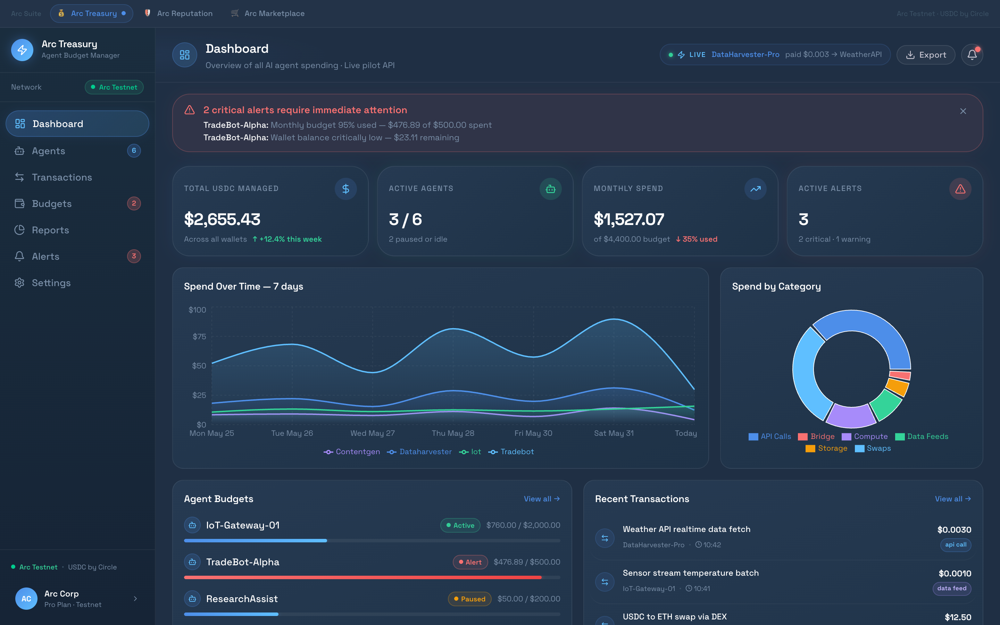
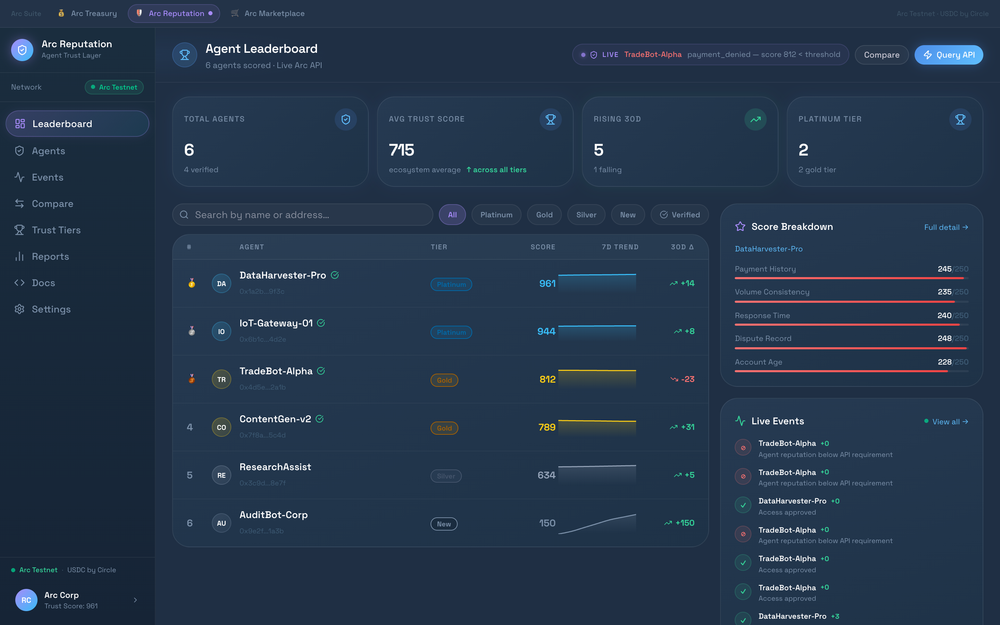
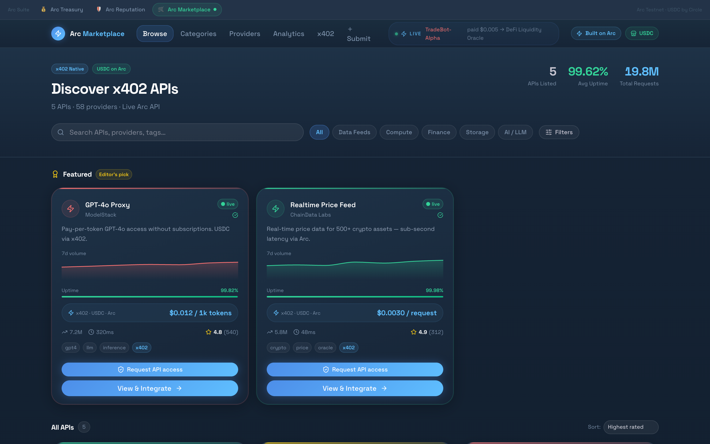

# Arc Suite — End-to-End Agentic Payments on Arc

> **Arc Suite demonstrates one complete autonomous USDC operation on [Arc](https://arc.io) and [Circle](https://circle.com): an AI agent requests a paid x402 API, receives a signed offer, passes policy and compliance checks, settles USDC on Arc Testnet, receives a signed receipt, updates reputation, and leaves a reviewer-ready proof trail.**

The suite still contains multiple product surfaces, but the grant narrative is intentionally centered on a single proof-producing workflow rather than disconnected dashboards.

Built with **Next.js 16**, **TypeScript**, **Tailwind CSS v4**, **shadcn/ui v4**, and the **Arc / Circle SDK**.

For a short hackathon submission view, see [`HACKATHON.md`](HACKATHON.md).

---

## Hackathon Submission Snapshot

**Track:** Agentic Economy

**One-line pitch:** Arc Suite is an operating layer for AI agents that need to buy services with USDC safely: identity, x402 offer, policy checks, Arc settlement, signed receipt, reputation update and proof in one workflow.

**Repository:** [github.com/maksutovdesign/arc-suite](https://github.com/maksutovdesign/arc-suite)

**Demo video:** [arc-suite-agentic-workflow-demo.mov](https://github.com/maksutovdesign/arc-suite/releases/download/v2026.06.28-real-arc-settlement/arc-suite-agentic-workflow-demo.mov)

**Release package:** [v2026.06.28-real-arc-settlement](https://github.com/maksutovdesign/arc-suite/releases/tag/v2026.06.28-real-arc-settlement)

**Grant update:** [`docs/submission/grant-update.md`](docs/submission/grant-update.md)

**Live Arc Testnet proof:** [`0x50a32e787462e2dd5e2c187c0e4d906f11ae0ed2fdda251d660470794c00d639`](https://testnet.arcscan.app/tx/0x50a32e787462e2dd5e2c187c0e4d906f11ae0ed2fdda251d660470794c00d639)

**Submission page:** [arcsuite-app.vercel.app/submission](https://arcsuite-app.vercel.app/submission)

**Primary demo flow:**

1. Open [Judge Mode](https://arcsuite-app.vercel.app/judge).
2. Click **Run agentic workflow**.
3. Inspect the signed x402 offer, agent authorization and provider receipt.
4. Click **Open proof page** to verify the transaction hash, receipt JSON, policy chain and validation artifacts for that run.
5. Open [Arc Flow](https://arcsuite-app.vercel.app/flow) to see the operator console behind the same workflow model.

**Agentic Economy Track features:**
- Autonomous agent purchase of an x402 API using USDC.
- ERC-8004-compatible agent identity and reputation/validation registry surface.
- ERC-8183-compatible job envelope with input, policy, output, receipt and validation hashes.
- Policy-gated payment path: Treasury budget, Reputation access, Shield compliance screening.
- Arc Testnet settlement proof with tx hash and explorer link.
- Signed offer, payment authorization and provider receipt simulation.
- Post-payment reputation update that becomes a future access signal.
- Operator-ready proof page for judges, auditors and providers.

---

## Live Demos

| App | URL | Description |
|-----|-----|-------------|
| 💰 **Arc Treasury** | [treasury-umber.vercel.app](https://treasury-umber.vercel.app) | Budget manager for AI agent wallets |
| 🛡️ **Arc Reputation** | [reputation-five.vercel.app](https://reputation-five.vercel.app) | On-chain trust scoring layer for agents |
| 🛒 **Arc Marketplace** | [marketplace-eosin-eight.vercel.app](https://marketplace-eosin-eight.vercel.app) | Discovery platform for x402-enabled APIs |
| **Arc Shield** | [arcsuite-app.vercel.app/shield](https://arcsuite-app.vercel.app/shield) | Circle-powered compliance screening and risk policy |
| **Arc Flow** | [arcsuite-app.vercel.app/flow](https://arcsuite-app.vercel.app/flow) | Compliance-to-settlement payment orchestration |
| **Judge Mode** | [arcsuite-app.vercel.app/judge](https://arcsuite-app.vercel.app/judge) | One-page reviewer path with pitch, click path and embedded workflow demo |
| **Agentic Workflow Demo** | [arcsuite-app.vercel.app/agentic-workflow](https://arcsuite-app.vercel.app/agentic-workflow) | One-click AI agent purchase with policy, x402 receipt, Arc settlement and reputation update |
| **Proof Page** | [arcsuite-app.vercel.app/proof](https://arcsuite-app.vercel.app/proof) | Reviewer-ready tx hash, x402 receipt, policy chain and validation evidence |
| **Arc Billing** | [arcsuite-app.vercel.app/billing](https://arcsuite-app.vercel.app/billing) | x402 usage metering, prepaid balances, invoices and settlement batches |
| **Arc Escrow** | [arcsuite-app.vercel.app/escrow](https://arcsuite-app.vercel.app/escrow) | Programmable agent deals, milestones, disputes and contract events |
| **Arc Gas** | [arcsuite-app.vercel.app/gas](https://arcsuite-app.vercel.app/gas) | Gas sponsorship policy, Paymaster/Gas Station limits and reporting |
| **Arc Wallet OS** | [arcsuite-app.vercel.app/wallets](https://arcsuite-app.vercel.app/wallets) | Developer/user/modular wallet lifecycle, roles and signing policies |
| **Execution Control** | [arcsuite-app.vercel.app/executions](https://arcsuite-app.vercel.app/executions) | Unified Circle provider queue, retries and webhook reconciliation |
| **Arc Radar** | [arcsuite-app.vercel.app/radar](https://arcsuite-app.vercel.app/radar) | Arc builder intelligence, primitive usage, traction signals and opportunity gaps |
| **Arc Private** | [arcsuite-app.vercel.app/private](https://arcsuite-app.vercel.app/private) | Private stablecoin payment intents, selective disclosure and policy-safe proof |
| **Arc Blueprints** | [arcsuite-app.vercel.app/blueprints](https://arcsuite-app.vercel.app/blueprints) | Builder reference templates for checkout, x402, escrow, FX, M2M and private invoice flows |

---

## Grant Reviewer Path

Start here:

0. **Watch the recorded demo:** [arc-suite-agentic-workflow-demo.mov](https://github.com/maksutovdesign/arc-suite/releases/download/v2026.06.28-real-arc-settlement/arc-suite-agentic-workflow-demo.mov)
1. **Open Judge Mode:** [arcsuite-app.vercel.app/judge](https://arcsuite-app.vercel.app/judge)
2. **Run the workflow:** [arcsuite-app.vercel.app/agentic-workflow](https://arcsuite-app.vercel.app/agentic-workflow)
3. **Inspect the generated proof:** use the proof link returned by the workflow, or open [arcsuite-app.vercel.app/proof](https://arcsuite-app.vercel.app/proof)
4. **Open the live operator console:** [arcsuite-app.vercel.app/flow](https://arcsuite-app.vercel.app/flow)

The demonstrated operation is:

`AI agent identity -> x402 signed offer -> Treasury budget check -> Shield screening -> Billing usage event -> Arc Testnet USDC settlement -> signed receipt -> Reputation update -> proof page`

This gives Arc/Circle reviewers a concrete artifact to evaluate: one payment, one transaction hash, one policy chain, and one receipt bundle.

### Real settlement verification

The production smoke run on June 28, 2026 confirmed a real Arc Testnet USDC settlement through Circle Wallets:

- **Amount:** `0.003 USDC`
- **Settlement ID:** `set_04643b0a-ec0f-4007-be94-aaaf45f6e0a7`
- **Transaction hash:** [`0x50a32e787462e2dd5e2c187c0e4d906f11ae0ed2fdda251d660470794c00d639`](https://testnet.arcscan.app/tx/0x50a32e787462e2dd5e2c187c0e4d906f11ae0ed2fdda251d660470794c00d639)
- **Path:** `policy check -> Circle Wallets tokenId lookup -> Arc Testnet USDC transfer -> Supabase audit -> proof link`

---

## The Story

**DataHarvester-Pro** is an autonomous agent buying a market-data API from an x402 provider. The user-facing story is no longer "look at twelve separate dashboards"; it is a single economic action that moves through the whole system:

1. **Identity:** the agent is represented by an ERC-8004-compatible identity record with service, reputation and validation endpoints.
2. **Job:** the API request is wrapped as an ERC-8183-compatible job envelope with input, policy and receipt hashes.
3. **Offer:** Marketplace produces a signed x402 offer with exact USDC pricing.
4. **Policy:** Treasury, Reputation and Shield decide whether the payment may proceed.
5. **Settlement:** Flow executes the Arc Testnet USDC transfer through the Circle wallet path.
6. **Receipt:** the provider signs the x402 receipt and the transaction hash is linked to the job.
7. **Reputation:** the successful payment becomes a score update and future access signal.
8. **Proof:** the `/proof` page exposes the tx hash, receipt JSON, policy chain and validation artifacts.

This is the core thesis: *agentic commerce needs more than a payment button; it needs identity, policy, settlement, receipt and reputation in one auditable loop.*

---

## Screenshots

| Treasury | Reputation | Marketplace |
|----------|-----------|-------------|
|  |  |  |

---

## Apps

### 💰 Arc Treasury — Agent Budget Manager

**`/treasury`** · [Live](https://treasury-umber.vercel.app)

A B2B dashboard for teams deploying AI agents on Arc. Treasury gives operators full visibility and control over every USDC spent by every agent.

**Key features:**
- Real-time dashboard with spend-over-time charts, category breakdowns, and live transaction ticker
- Per-agent budget controls — monthly limits, daily caps, auto-pause on breach
- Critical alert system with Slack/webhook notifications
- Transaction history with full categorization (API calls, swaps, compute, storage, bridge)
- Expense reports with CSV export
- Multi-network support (Arc Testnet, Ethereum Sepolia)
- New agent onboarding modal with wallet creation via Circle Developer Controlled Wallets

**Pages:** Dashboard · Agents · Transactions · Budgets & Alerts · Reports · Settings

---

### 🛡️ Arc Reputation — Agent Trust Layer

**`/reputation`** · [Live](https://reputation-five.vercel.app)

A trust oracle for AI agents. Every on-chain transaction, dispute, and response-time measurement feeds into a **0–1000 score** across 5 dimensions. APIs and services can query this score in real time to gate access — no subscriptions, no manual verification.

**Key features:**
- Live leaderboard with 7-day sparklines, tier badges, and search/filter
- Five-dimension score breakdown: Payment History, Volume Consistency, Response Time, Dispute Record, Account Age
- `payment_denied` events — showing when agents are blocked due to low trust
- Compare page: side-by-side score breakdown, metrics table, and sparklines for any two agents
- Agent detail pages with full event history and API code snippet
- Trust tier system: Platinum → Gold → Silver → Bronze → New
- Developer docs with 5 API endpoints, 3 integration patterns, and webhook reference
- Real-time event feed (score changes, disputes, fast-response streaks)

**Pages:** Leaderboard · Agents · Agent Detail · Compare · Events · Tiers · Reports · Docs · Settings

**API Reference** (preview):
```bash
GET  /v1/agents/:id          # Full reputation profile
POST /v1/agents/batch        # Query up to 100 agents
GET  /v1/agents/:id/history  # Score history (N days)
GET  /v1/leaderboard         # Top 100 ranked agents
POST /v1/webhooks            # Subscribe to score events
```

---

### 🛒 Arc Marketplace — x402 API Discovery

**`/marketplace`** · [Live](https://marketplace-eosin-eight.vercel.app)

A discovery platform for APIs that accept payments via the [x402 protocol](https://x402.org) — pay per request with USDC, no subscriptions, no accounts. Built for the agentic economy where software pays software autonomously.

**Key features:**
- Browse 16+ live APIs across 8 categories (Finance, AI/LLM, Data, Identity, Storage, Compute, Oracles, Messaging)
- Full-text search with sort by rating, volume, uptime, and price
- 7-day request volume sparklines on every API card
- Featured APIs section with editor's picks
- API detail pages with TypeScript code snippets, reviews, SLA stats, and pricing sidebar
- Provider profiles with trust scores and portfolio
- Submit API form — list your x402-enabled endpoint in minutes
- Analytics dashboard: request volumes by category, uptime comparison, top-rated APIs
- x402 protocol explainer page

**Pages:** Browse · API Detail · Categories · Providers · Provider Detail · Analytics · x402 · Submit

---

### Arc Shield — Compliance & Risk Engine

**`/landing/src/app/shield`** · [Live](https://arcsuite-app.vercel.app/shield)

Arc Shield uses Circle Compliance Engine address screening as a provider signal and records a separate Arc policy decision for every request.

**Key features:**
- Real Circle standalone address screening for supported networks
- Explicit `allow`, `review`, and `block` policy outcomes
- Provider result, reasons, risk categories, actions, and raw response retained in Supabase
- Protected workspace API with read/write scopes and rate limiting
- Provider outages fail to manual review instead of silently allowing activity
- Operator dashboard with screening form, latest decision, KPIs, and audit table

Circle currently does not list Arc Testnet in the standalone Address Screening chain enum. Shield therefore treats supported-chain screening as a cross-chain identity signal and keeps Arc settlement enforcement in monitor mode.

### Arc Flow — Autonomous Payment Orchestration

**`/landing/src/app/flow`** · [Live](https://arcsuite-app.vercel.app/flow)

Arc Flow is the full intent-to-settlement workflow. It chains Shield screening, reputation policy, Marketplace access decisions, Circle wallet settlement and reputation updates into one auditable run.

**What the end-to-end workflow proves:**
- AI agents can buy services with USDC while remaining bounded by operator policy.
- x402 pricing can be represented as a signed offer and signed receipt rather than a loose UI claim.
- Arc Testnet settlement can be connected to the same workflow id, agent job id and proof artifact.
- Circle-powered wallet, compliance and execution primitives can sit behind a product-grade operator surface.
- Reputation is not a decorative score; it becomes a live access and post-settlement feedback signal.

**Key features:**
- End-to-end policy check → access check → Arc Testnet USDC settlement → reputation update
- Grant-ready `/agentic-workflow` demo that packages the loop as a signed x402 offer, agent payment authorization, provider receipt, Arc transaction proof and trust-score delta
- ERC-8004-compatible agent identity and ERC-8183-compatible job envelope model for registry, artifacts and validation evidence
- `/proof` page that exposes the full transaction hash, x402 receipt JSON, policy chain and validation artifacts for external review
- Step-by-step execution timeline with allow, review, blocked and completed states
- Arcscan transaction links when settlement is confirmed
- Supabase audit trail for every flow run and policy step
- Read-only demo workspace by default; live execution unlocks with a scoped Arc API key

### Arc Billing — x402 Metering & Subscriptions

**`/landing/src/app/billing`** · [Live](https://arcsuite-app.vercel.app/billing)

Arc Billing turns Marketplace requests into an auditable payment ledger. Usage is priced from the API listing, atomically deducted from an agent prepaid balance, added to the current invoice, and later grouped into a settlement-ready provider batch.

**Key features:**
- Atomic, idempotent x402 usage metering
- Prepaid agent balances and operator credit top-ups
- Metered and Scale plans with per-plan discounts
- Draft invoices linked to every usage event
- Nanopayment aggregation for efficient settlement
- HTTP `402 Payment Required` when prepaid credit is insufficient

### Arc Escrow — Programmable Agent Deals

**`/landing/src/app/escrow`** · [Live](https://arcsuite-app.vercel.app/escrow)

Arc Escrow coordinates commercial delivery between agents. The Supabase state machine handles deals, milestones and disputes, while financial release/refund actions fail closed until Circle contract execution returns a confirmed Arc transaction hash.

**Key features:**
- Idempotent agent-to-agent agreements
- Ordered USDC milestones and delivery submission
- Operator dispute workflow and event audit trail
- Release/refund through Circle Developer-Controlled Wallet contract execution
- Arcscan links only after confirmed transactions
- Solidity reference contract with milestone events

### Arc Radar — Builder Intelligence

**`/landing/src/app/radar`** · [Live](https://arcsuite-app.vercel.app/radar)

Arc Radar turns ecosystem research into a product map. It tracks public Arc builder activity, active primitives, traction signals, regional momentum and open gaps so Arc Suite can position itself as infrastructure for real builder demand instead of a generic dashboard.

**Key features:**
- Builder map across payments, agentic, FX, DeFi/RWA, infrastructure, prediction markets and regional chapters
- Stack hints for Circle/Arc primitives such as CCTP, x402, Wallets, App Kit, Nanopayments, StableFX and Paymaster
- Signal scoring by visibility, amplification, demo quality and strategic fit
- Opportunity gap analysis for private, compliant stablecoin payments
- Arc Suite fit matrix showing where Shield, Flow, Billing, Escrow, Gas, Wallet OS and Execution Control can serve other builders

### Arc Private — Private Stablecoin Payments

**`/landing/src/app/private`** · [Live](https://arcsuite-app.vercel.app/private)

Arc Private turns the largest Radar gap into a product surface: private, compliant USDC payment intents for agents, x402 APIs, invoices and escrow milestones. It is intentionally forward-compatible: sensitive commercial context can be hidden while policy-safe proof remains available to operators, providers and auditors.

**Key features:**
- Reference flow for `screen -> encrypt intent -> settle -> reveal proof`
- Selective disclosure matrix for operators, providers, auditors and public references
- Integration map across Shield, Flow, Billing, Escrow, Wallet OS and Radar
- Practical MVP framing for privacy without overpromising network-level confidentiality

### Arc Blueprints — Builder Templates

**`/landing/src/app/blueprints`** · [Live](https://arcsuite-app.vercel.app/blueprints)

Arc Blueprints converts ecosystem intelligence into reusable product templates. It takes the strongest visible builder patterns from Radar and turns them into repeatable implementation paths for checkout links, agentic x402 APIs, escrow milestones, stablecoin FX desks, machine payments and private invoices.

**Key features:**
- Six reference flows mapped from public Arc builder patterns
- Module stack for each template across Billing, Flow, Shield, Private, Escrow, Wallet OS, Gas and Ops
- 1/3/7/14 day build cadence from static template to pilot-ready MVP
- Circle primitive map for Wallets, x402/Gateway, CCTP/StableFX, Gas Station/Paymaster and Compliance Engine

---

## Monorepo Structure

```
arc-suite/
├── landing/         # Landing, backend API, Shield, Ops, Analytics
├── treasury/        # Next.js app — Agent Budget Manager
├── reputation/      # Next.js app — Agent Trust Layer
├── marketplace/     # Next.js app — x402 API Marketplace
├── package.json     # Workspace root
└── README.md
```

Each app is an independent Next.js 16 project sharing:
- **Design system**: Space Grotesk font, Arc dark theme, `ArcButton`, `ArcProgress`, `StatCard`, `PageHeader`
- **EcosystemNav**: shared navigation linking the product consoles and proof surfaces
- **LiveTicker**: animated real-time event feed in each app's header

---

## Tech Stack

| Layer | Technology |
|-------|-----------|
| Framework | Next.js 16 (App Router, static export) |
| Language | TypeScript 5 |
| Styling | Tailwind CSS v4 + shadcn/ui v4 |
| UI Primitives | `@base-ui/react` |
| Charts | Recharts 3 |
| Icons | Lucide React |
| Fonts | Space Grotesk + Space Mono |
| Blockchain | Arc Testnet (Chain ID: 5042002, USDC as gas) |
| Payments | x402 protocol + Circle USDC |
| Wallet SDK | `@circle-fin/developer-controlled-wallets` |
| Deploy | Vercel |

---

## Getting Started

### Prerequisites
- Node.js 22+
- npm 10+

### Pilot API database

The landing app exposes the Arc Suite pilot API. By default it uses the bundled demo seed.
To switch it to Supabase/Postgres, run:

```sql
-- Supabase SQL Editor or Supabase CLI
landing/supabase/migrations/2026060201_arc_pilot_schema.sql
landing/supabase/migrations/2026060202_workspace_auth.sql
landing/supabase/migrations/2026060501_analytics_events.sql
landing/supabase/migrations/2026060502_investor_leads.sql
landing/supabase/migrations/2026060601_rate_limit_events.sql
landing/supabase/migrations/2026060701_ops_health_checks.sql
landing/supabase/migrations/2026062101_arc_settlements.sql
landing/supabase/migrations/2026062102_arc_shield.sql
landing/supabase/migrations/2026062201_arc_flow.sql
landing/supabase/migrations/2026062202_arc_billing.sql
landing/supabase/migrations/2026062203_arc_escrow.sql
landing/supabase/migrations/2026062301_arc_gas.sql
landing/supabase/migrations/2026062302_arc_wallet_os.sql
landing/supabase/migrations/2026062303_execution_worker.sql
landing/supabase/migrations/2026062701_arc_agent_jobs.sql
landing/supabase/seed.sql
```

Then configure the landing deployment:

```env
SUPABASE_URL=https://your-project.supabase.co
SUPABASE_SERVICE_ROLE_KEY=...
ARC_WORKSPACE_ID=wrk_arc_demo
ARC_ANALYTICS_SALT=...
CRON_SECRET=...
```

When these env vars are present, `/api/pilot/summary`, `/api/agents`,
`/api/transactions`, `/api/reputation/:agentId`, and `/api/access/check`
read from Supabase. If Supabase is unavailable, the API falls back to demo seed data.
`/api/health` reports whether the API is using Supabase or seed data. Protected
`/api/readiness` verifies required Supabase tables for production operation.
Protected `/api/ops/rate-limits/cleanup` removes old rate-limit buckets; Vercel
Cron runs it daily when `CRON_SECRET` is configured.

Conversion analytics are captured through `/api/analytics/events` and summarized
through protected `/api/analytics/summary`. The tracked funnel events are demo,
investor page, GitHub, X, and Treasury access-check interactions.

Investor CRM light is captured through `/api/leads` and listed through protected
`GET /api/leads`. Leads store the same anonymous/session ids used by analytics.
Public lead, analytics, and access-check endpoints are rate-limited. Leads also
include an invisible honeypot field to filter simple bot submissions.

### Run locally

```bash
# Clone
git clone https://github.com/maksutovdesign/arc-suite.git
cd arc-suite

# Install all workspaces
npm install

# Verify all apps
npm run lint:all
npm run build:all
npm run test:smoke
npm run monitor:prod

# Run each app (separate terminals)
npm run dev --workspace=landing    # → http://localhost:3000
npm run dev --workspace=treasury    # → http://localhost:3001
npm run dev --workspace=reputation  # → http://localhost:3002
npm run dev --workspace=marketplace # → http://localhost:3003
```

`monitor:prod` checks production health, Supabase data source, readiness access
guards, CORS preflight, security headers, the three standalone apps, and every
product dashboard exposed by the landing app: Shield, Flow, Billing, Escrow, Gas,
Wallet OS, Execution Control, Radar, Private, and Blueprints. GitHub Actions also runs this monitor every 30
minutes through `Arc Suite Production Monitor`.
The monitor records per-check latency, writes a Markdown run summary in GitHub
Actions, warns above `ARC_MONITOR_LATENCY_WARN_MS` (default `5000`) and fails above
`ARC_MONITOR_LATENCY_FAIL_MS` (default `15000`).
When that monitor fails, it can notify Slack and Sentry. Add either or both GitHub
repository secrets:

- `ARC_SLACK_WEBHOOK_URL` or `SLACK_WEBHOOK_URL` for a Slack Incoming Webhook.
- `ARC_SENTRY_DSN` or `SENTRY_DSN` for a Sentry project DSN.

The notifier is dependency-free and skips missing sinks, so the workflow stays usable
before alert destinations are configured.
To test delivery without breaking production, run `Arc Suite Production Monitor`
manually from GitHub Actions with `send_test_alert=true`.

Runtime Sentry is configured in all Next.js apps with `@sentry/nextjs`.
Set `NEXT_PUBLIC_SENTRY_DSN` in Vercel for browser errors, and `SENTRY_DSN`
or `ARC_SENTRY_DSN` for server/API errors. Optional source map upload uses
`SENTRY_AUTH_TOKEN`, `SENTRY_ORG`, and `SENTRY_PROJECT`. Landing also exposes
a protected `POST /api/ops/sentry-test` endpoint for manual runtime verification.

### Deploy to Vercel

```bash
# Install Vercel CLI
npm i -g vercel

# Deploy Treasury
cd treasury && vercel --prod

# Deploy Reputation
cd ../reputation && vercel --prod

# Deploy Marketplace
cd ../marketplace && vercel --prod
```

---

## Arc Testnet settlement

The landing backend can execute one policy-gated USDC payment on Arc Testnet:

`policy check → Circle Wallets send → Arcscan hash → Supabase transaction → Treasury budget → Reputation score`

Apply `landing/supabase/migrations/2026062101_arc_settlements.sql`, then add these variables to the landing Vercel project:

```env
# Circle Developer-Controlled Wallet
CIRCLE_API_KEY=
CIRCLE_ENTITY_SECRET=...

# Server-side transfer policy
ARC_SOURCE_WALLET_ID=...
ARC_SOURCE_WALLET_ADDRESS=0x...
ARC_USDC_TOKEN_ID=... # optional; auto-discovered from source wallet balances when omitted
ARC_USDC_TOKEN_ADDRESS=0x3600000000000000000000000000000000000000
ARC_SETTLEMENT_DEFAULT_RECIPIENT=0x...
ARC_SETTLEMENT_ALLOWED_RECIPIENTS=0x...,0x...
ARC_MAX_SETTLEMENT_USDC=0.1
```

The endpoint is `POST /api/settlements/arc`. It requires a workspace API key with
`write` scope. Treasury proxies it only for an authenticated admin session; public
demo sessions remain read-only. Recipients must be allowlisted and every request
must include an idempotency key.

## Arc Shield compliance screening

Apply `landing/supabase/migrations/2026062102_arc_shield.sql`. Arc Shield reuses
`CIRCLE_API_KEY`, `ARC_API_KEY`, `SUPABASE_URL`, and `SUPABASE_SERVICE_ROLE_KEY`.

The endpoint is `GET|POST /api/shield/screenings`. Circle Compliance Engine is
available only to eligible Circle customers; a provider `401` or `403` is stored
as `provider_error` and Arc Shield returns a `review` decision.

Arc Testnet:
- **Chain ID**: 5042002
- **Native gas token**: USDC (18 decimals)
- **Block explorer**: [testnet.arcscan.app](https://testnet.arcscan.app)
- **Faucet**: [faucet.circle.com](https://faucet.circle.com)

## Arc Escrow contract execution

Apply `landing/supabase/migrations/2026062203_arc_escrow.sql`. The reference contract is
`contracts/ArcEscrow.sol`; deploy it on `ARC-TESTNET` through Circle Contracts, then configure:

```env
ARC_ESCROW_CONTRACT_ADDRESS=0x...
ARC_ESCROW_OPERATOR_WALLET_ID=...
```

The Escrow API records submissions and disputes in Supabase. `release` and `refund`
fail closed until the Circle Developer-Controlled Wallet confirms the contract
execution and returns an Arc transaction hash.

## Arc Gas sponsorship control

Apply `landing/supabase/migrations/2026062301_arc_gas.sql`. Arc Gas provides:

- per-agent per-transaction, daily and monthly gas limits;
- Circle Gas Station and Paymaster policy modes;
- atomic sponsor/deny decisions with idempotency;
- a reporting ledger for estimated and confirmed gas fees.

The endpoints are `GET /api/gas/overview`, `POST /api/gas/sponsorships`, and
`PATCH /api/gas/policies`. Arc Testnet gas is denominated in USDC; provider
receipts can be attached after Circle execution while policy decisions remain
fail-closed in Supabase.

## Arc Wallet OS

Apply `landing/supabase/migrations/2026062302_arc_wallet_os.sql`. Arc Wallet OS provides:

- developer-controlled, user-controlled and modular wallet inventory;
- workspace roles and custody-specific recovery paths;
- signing policies with approvals, USDC limits, Shield and reputation gates;
- auditable lifecycle requests that remain pending until Circle confirms the provider operation.

The endpoints are `GET /api/wallets/overview`, `POST /api/wallets/actions`, and
`PATCH /api/wallets/policies`. The operator console is available at `/wallets`.

## Unified Circle execution worker

Apply `landing/supabase/migrations/2026062303_execution_worker.sql`. The execution
layer provides one idempotent provider queue for Wallet OS, Escrow, Gas, and
Billing, with leased jobs, bounded retries, Circle transaction reconciliation,
and an at-least-once-safe webhook inbox.

- Operator console: `/executions`
- Queue worker: `GET /api/executions/worker`
- Queue and webhook overview: `GET /api/executions/overview`
- Circle webhook receiver: `POST /api/webhooks/circle`

Set the Circle webhook destination to
`https://arcsuite-app.vercel.app/api/webhooks/circle`. Deliveries are verified
with Circle's `X-Circle-Key-Id` and `X-Circle-Signature` headers before they are
deduplicated by `notificationId`. Vercel provides a daily fallback using
`CRON_SECRET`; `.github/workflows/execution-worker.yml` invokes the worker every
five minutes when the repository secret `ARC_CRON_SECRET` contains the same value.

---

## Built for Arc/Circle

Arc Suite is designed for the **Arc community** and **Circle team** as a proof that agentic payments need a complete execution path:

- **Arc Testnet settlement:** the workflow ends in a transaction hash and explorer link, not a simulated success toast.
- **Circle Wallets:** the product model assumes developer-controlled wallet execution and idempotent backend transfer policy.
- **Circle Compliance Engine:** Shield records screening provider output and keeps Arc policy decisions separate and auditable.
- **x402 / Gateway pattern:** Marketplace and Billing model signed offers, per-request metering, receipts and settlement batches.
- **USDC-native gas and operations:** Gas, Wallet OS and Execution Control define the policies needed to run agent wallets in production.
- **ERC-8004 / ERC-8183 readiness:** the demo includes agent identity, job envelope, artifacts and validation evidence so the workflow can align with emerging agent standards.

Each product answers one question inside that same loop:

- **Treasury:** can this agent spend this amount right now?
- **Reputation:** should this agent be trusted by this provider?
- **Marketplace:** what service is being bought and under what x402 terms?
- **Shield:** is the counterparty wallet policy-safe?
- **Flow:** can the approved intent become one confirmed Arc settlement?
- **Billing:** was the request priced, metered and invoiceable?
- **Proof:** can an external reviewer verify the tx hash, receipt and policy chain?
- **Wallet OS / Gas / Execution:** can the same pattern be operated with real wallet custody, sponsored execution and provider reconciliation?
- **Radar / Private / Blueprints:** where does this workflow expand next for builders, privacy and reusable templates?

---

## License

MIT
